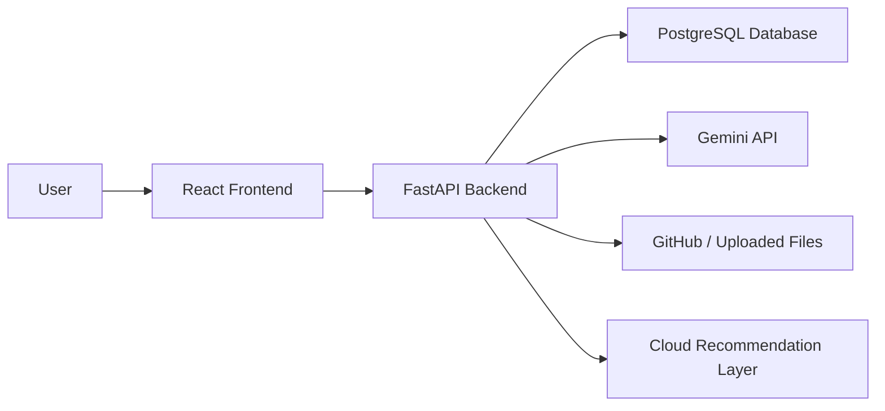
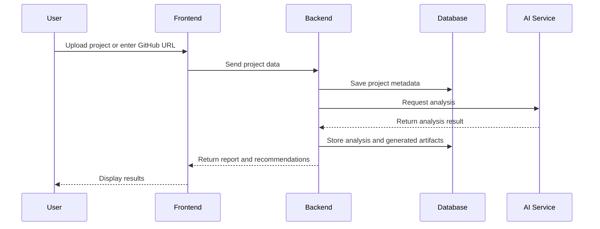
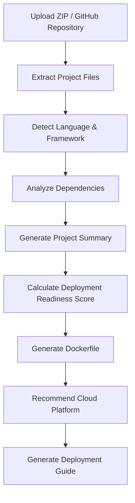
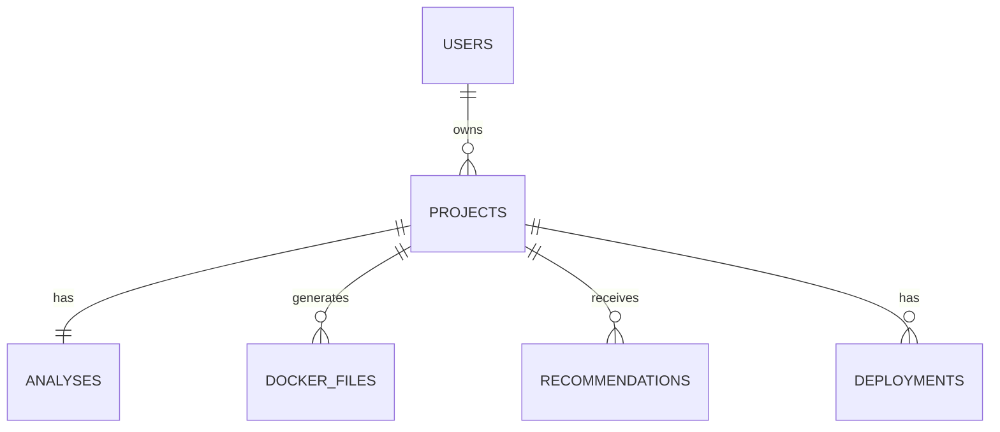

# 05. System Architecture

## 1. High-Level Architecture

The AI DevOps Assistant follows a three-tier web architecture. The frontend provides the user interface, the backend processes requests and integrates with AI services, and the database stores persistent system data. The architecture is designed to be modular, easy to extend, and suitable for a semester-long engineering project.

## 2. Component Description

| Component | Description |
|---|---|
| React Frontend | Provides all user-facing screens such as authentication, dashboard, upload, analysis, deployment recommendation, and history. |
| FastAPI Backend | Handles request routing, validation, business logic, AI service integration, and database operations. |
| PostgreSQL Database | Stores users, projects, analysis results, Dockerfile data, recommendations, and deployment history. |
| Gemini API | Generates project analysis summaries, deployment readiness insights, Dockerfile suggestions, and checklist content. |
| File Storage Layer | Stores uploaded archives or temporary project files for analysis. |
| Recommendation Engine | Analyzes the detected technology stack and project characteristics to recommend the most suitable cloud platform, deployment strategy (Container, Serverless, Static Hosting, or Virtual Machine), and deployment guidance. |

## 3. Data Flow

The typical data flow begins when a user uploads a project. The backend accepts the artifact, stores metadata, analyzes the project, generates deployment assets, and returns results to the frontend.

## 4. AI Workflow

The AI workflow is responsible for interpreting the project structure and generating useful guidance. The workflow follows a stepwise pipeline from upload to guide generation.

## 5. Backend Architecture

The backend is organized into separate modules to maintain clarity and simplify future extension. The main modules include:

- Authentication module for login and registration
- User module for profile and account management
- Project module for upload, validation, and metadata storage
- Analysis module for AI integration and report generation
- Docker generation module for producing deployment file suggestions
- Recommendation module for platform selection logic
- History module for retrieving prior projects and deployment records

The backend exposes REST APIs and uses service-layer functions to process data before interacting with the database.

## 6. Frontend Architecture

The frontend uses a component-based design with pages for authentication, dashboard, upload, results, recommendations, deployment history, and user profile. The interface is designed to be simple, responsive, and aligned with the user journey from upload to deployment preparation.

The key frontend layers are:

- Presentation layer for UI pages and components
- State management for session data and project results
- API integration layer for communication with the backend
- Form and validation components for uploaded projects and user input

## 7. Database Layer

The database layer stores structured records related to users, projects, analysis outputs, deployment artifacts, and deployments. The schema is relational to ensure consistency and ease of querying. The database layer is also responsible for maintaining foreign key relationships between entities.

## 8. Deployment Architecture

The initial deployment architecture for the project is expected to follow a containerized approach. The frontend and backend can be packaged as separate services and deployed on a lightweight hosting platform such as Render or Railway. In the academic prototype stage, deployment is likely to be limited to a development or staging environment.

The proposed deployment flow is:

1. Frontend served through a static hosting service or container
2. Backend hosted as a FastAPI service
3. PostgreSQL hosted as a managed database service
4. AI service accessed through API calls from the backend

## 9. Future Enhancements

Future versions of the system may include:

- Full CI/CD pipeline support
- Real deployment to AWS, Azure, or Google Cloud
- Advanced monitoring and logging
- Multi-container application support
- Team collaboration and project sharing
- User role management and admin dashboards
