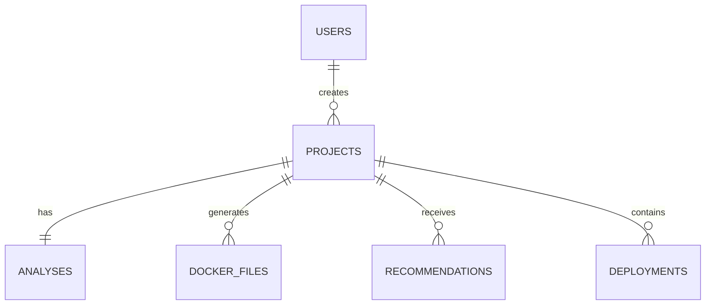

# 06. Database Design

## 1. Database Overview

The database for the AI DevOps Assistant is designed as a relational database using PostgreSQL. The schema is intended to store user accounts, uploaded projects, AI-generated analysis reports, Dockerfile generation results, cloud recommendations, and deployment records. A relational model is suitable because the system involves clear one-to-many and one-to-one relationships between users, projects, and generated artifacts.

## 2. Entity Relationship Description

The database supports the following core relationships:

- One user can create many projects.
- Each project can have one analysis report.
- Each project can generate one Dockerfile draft.
- Each project can have multiple recommendations.
- Each project can have multiple deployment records.

## 3. Tables

### 3.1 Users

| Column | Type | Constraints | Description |
|---|---|---|---|
| id | SERIAL | PRIMARY KEY | Unique user identifier |
| name | VARCHAR(100) | NOT NULL | Full name of the user |
| email | VARCHAR(255) | UNIQUE, NOT NULL | User email address |
| password_hash | VARCHAR(255) | NOT NULL | Securely stored password hash |
| created_at | TIMESTAMP | DEFAULT CURRENT_TIMESTAMP | Account creation time |
| last_login | TIMESTAMP | NULL | Last successful login time |

### 3.2 Projects

| Column | Type | Constraints | Description |
|---|---|---|---|
| id | SERIAL | PRIMARY KEY | Unique project identifier |
| user_id | INT | FOREIGN KEY REFERENCES users(id) | Owner of the project |
| title | VARCHAR(255) | NOT NULL | Project name |
| description | TEXT | NULL | Optional description |
| source_type | VARCHAR(50) | NOT NULL | ZIP or GitHub |
| source_url | TEXT | NULL | GitHub repository URL if applicable |
| file_name | VARCHAR(255) | NULL | Uploaded archive file name |
| status | VARCHAR(50) | NOT NULL | Upload or analysis status |
| created_at | TIMESTAMP | DEFAULT CURRENT_TIMESTAMP | Project upload time |

### 3.3 Analyses

| Column | Type | Constraints | Description |
|---|---|---|---|
| id | SERIAL | PRIMARY KEY | Unique analysis identifier |
| project_id | INT | FOREIGN KEY REFERENCES projects(id) | Associated project |
| language | VARCHAR(100) | NOT NULL | Detected primary language |
| framework | VARCHAR(100) | NULL | Detected framework |
| dependencies | TEXT | NULL | Summary of dependencies |
| structure_summary | TEXT | NULL | Summary of project structure |
| readiness_score | INT | NOT NULL | Numerical readiness score |
| ai_summary | TEXT | NULL | AI-generated narrative summary |
| created_at | TIMESTAMP | DEFAULT CURRENT_TIMESTAMP | Analysis timestamp |

### 3.4 Docker_Files

| Column | Type | Constraints | Description |
|---|---|---|---|
| id | SERIAL | PRIMARY KEY | Unique Dockerfile record identifier |
| project_id | INT | FOREIGN KEY REFERENCES projects(id) | Associated project |
| file_name | VARCHAR(100) | NOT NULL | Dockerfile name |
| content | TEXT | NOT NULL | Dockerfile contents |
| base_image | VARCHAR(100) | NULL | Suggested base image |
| generated_at | TIMESTAMP | DEFAULT CURRENT_TIMESTAMP | Generation timestamp |

### 3.5 Recommendations

| Column | Type | Constraints | Description |
|---|---|---|---|
| id | SERIAL | PRIMARY KEY | Unique recommendation identifier |
| project_id | INT | FOREIGN KEY REFERENCES projects(id) | Associated project |
| provider | VARCHAR(100) | NOT NULL | Recommended provider such as Render or Railway |
| reason | TEXT | NOT NULL | Explanation for recommendation |
| confidence_score | DECIMAL(4,2) | NOT NULL | Confidence level |
| estimated_cost | VARCHAR(100) | NULL | Optional cost estimate |
| created_at | TIMESTAMP | DEFAULT CURRENT_TIMESTAMP | Recommendation timestamp |

### 3.6 Deployments

| Column | Type | Constraints | Description |
|---|---|---|---|
| id | SERIAL | PRIMARY KEY | Unique deployment record identifier |
| project_id | INT | FOREIGN KEY REFERENCES projects(id) | Associated project |
| provider | VARCHAR(100) | NOT NULL | Deployment target provider |
| environment | VARCHAR(50) | NOT NULL | Example: staging or production |
| deployment_url | TEXT | NULL | URL returned after deployment |
| status | VARCHAR(50) | NOT NULL | Pending, success, or failed |
| deployed_at | TIMESTAMP | NULL | Deployment completion time |

## 4. Primary Keys

- users.id
- projects.id
- analyses.id
- docker_files.id
- recommendations.id
- deployments.id

## 5. Foreign Keys

- projects.user_id → users.id
- analyses.project_id → projects.id
- docker_files.project_id → projects.id
- recommendations.project_id → projects.id
- deployments.project_id → projects.id

## 6. Relationships

| Parent Entity | Child Entity | Relationship Type |
|---|---|---|
| users | projects | One-to-many |
| projects | analyses | One-to-one |
| projects | docker_files | One-to-many |
| projects | recommendations | One-to-many |
| projects | deployments | One-to-many |

## 7. Suggested Indexes

| Index | Table | Purpose |
|---|---|---|
| idx_users_email | users | Improve lookup by email |
| idx_projects_user_id | projects | Improve retrieval of projects by user |
| idx_analyses_project_id | analyses | Improve analysis lookup by project |
| idx_recommendations_project_id | recommendations | Improve recommendation lookup |
| idx_deployments_project_id | deployments | Improve deployment history retrieval |

## 8. Mermaid ER Diagram

